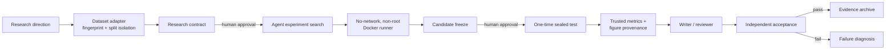

# Pathology-AI-Scientist


**An auditable, end-to-end research-agent framework for computational pathology, with PathMNIST as its first reference implementation.**

Pathology-AI-Scientist coordinates long-running research tasks across LLMs, datasets, generated code, Docker,
GPU experiments, evidence validation, and manuscript tooling. Its central feature is not autonomous
paper writing: it is knowing what ran, what it cost, what evidence supports each result, and when the
system must stop for human approval.

> **Status:** `v0.1.0-beta`, advanced research prototype. This repository is **source-available** under
> the restricted AI Scientist Source Code License; it is not OSI open source. It is not a medical device,
> clinical evidence, medical advice, or an autonomous deployment system.

The repository contains the executable framework, required upstream assets, configuration,
deployment helpers, and regression tests. Historical experiment reports, generated papers,
one-off recovery scripts, and private task evidence are not part of the source distribution.
A passing Demo or mocked test is not a real-service end-to-end run; see the
[publication validation limits](docs/UPSTREAM_PUBLICATION.md).

## See it in five minutes

The deterministic Demo Mode needs no dataset, GPU, API key, or network call after the image is built.
It demonstrates the control surface using explicitly synthetic fixture metrics. On Windows, this
project supports Docker Engine installed directly inside Ubuntu WSL 2; Docker Desktop is optional.

```bash
docker compose up --build
```

Open <http://127.0.0.1:8501>. The UI walks through research intent, the transactional Agent state graph,
research-contract approval, tool/budget/retry controls, trusted metrics, evidence provenance, and the
independent acceptance report.

Run Docker commands in the environment that owns the Docker Engine. For this repository's validated
Windows setup, enter `Ubuntu-24.04` and build from the Windows checkout with:

```bash
cd <WSL-PATH-TO-REPOSITORY>
bash scripts/build-demo-wsl.sh . path-ai-scientist-demo:local
bash scripts/verify-docker.sh path-ai-scientist-demo:local
```

See [Docker on Windows with WSL 2](docs/DOCKER_WSL.md) for UI launch commands, PowerShell invocation,
and the `xattr ... permission denied` workaround. A clean clone stored directly in the WSL Linux
filesystem can use `docker compose up --build` normally.

Without Docker, use Python 3.11 or 3.12:

```bash
python -m venv .venv
# PowerShell: .\.venv\Scripts\Activate.ps1
# WSL/Linux: source .venv/bin/activate
python -m pip install -e ".[ui]"
path-ai-scientist-demo --output .demo/pathmnist-offline
PATH_SCIENTIST_DEMO=1 python -m streamlit run app.py
```

In PowerShell, use
`$env:PATH_SCIENTIST_DEMO="1"; python -m streamlit run app.py` for the final command.

## Why a research Agent is harder than a chat Agent

A plausible answer is not enough. A research workflow must survive restarts, isolate the test set,
account for provider cost, execute untrusted generated code, distinguish model claims from measured
results, and refuse publication when evidence is incomplete. Pathology-AI-Scientist implements these as system
invariants rather than prompt suggestions.



Every formal transition follows:

```text
validate inputs → perform work → validate outputs → commit task state
```

A tool returning successfully does not make a stage complete. Missing manifests, untrusted statistics,
invalid references, exhausted budgets, or a violated test policy stop the workflow.

## Engineering highlights

- **Durable orchestration:** transactional state, bounded retries, rollback, resume, and idempotent
  response reuse.
- **Human-in-the-loop control:** separate approvals for the research contract, paid calls, sealed test,
  and PDF build.
- **Safe generated code:** non-root Docker execution, no network, restricted mounts, and no API key in
  the experiment environment.
- **Cost governance:** request reservation, persistent task ledger, stable request IDs, and a hard ceiling.
- **Scientific integrity:** split isolation, candidate freeze, one-time test evaluation, repeat requirements,
  trusted statistics, and complete result reporting.
- **Evidence provenance:** dataset, code, execution, metric, figure, claim, and archive hashes remain
  machine-checkable.
- **Independent acceptance:** a deterministic validator—not the paper writer—decides whether an output
  may be described as a formal research artifact.

## Framework extension boundary

`pathmnist.framework` exposes beta `Protocol` contracts:

```python
from pathlib import Path
from pathmnist.dataset_adapter import DatasetAdapter as GenericImageDatasetAdapter

adapter = GenericImageDatasetAdapter(seed=7)
profile = adapter.discover(Path("my_dataset"), Path("dataset_profile.json"))
print(profile.content_sha256, profile.split_counts)
```

- `DatasetAdapter`: discover, describe, fingerprint, and isolate dataset splits.
- `ExperimentBackend`: preflight, run experiments, freeze a candidate, and evaluate the sealed test.
- `ArtifactValidator`: validate manifests, trusted metrics, figures, references, and disclosures.
- `ResearchTaskConfig`: provider-neutral intent, adapter, budget, roles, permissions, and output root.

PathMNIST is the only complete reference adapter in beta. These interfaces document the intended
extension seam but are not guaranteed stable before 1.0.

## Full Research Mode

Full mode requires a verified PathMNIST-64 archive, Docker, suitable compute, and an explicitly
authorized OpenAI-compatible provider. Obtain PathMNIST from the official MedMNIST distribution
(DOI `10.5281/zenodo.10519652`), retain its attribution, and keep `pathmnist_64.npz` outside Git.

```bash
python -m pip install -e ".[agent,ui,paper,training]"
path-ai-scientist init --task-id TASK --dataset-path pathmnist_64.npz --direction "..."
path-ai-scientist run --task-id TASK
path-ai-scientist status --task-id TASK
```

The orchestrator stops at authorization boundaries. Continue only after inspecting status and cost:

```bash
path-ai-scientist approve-contract --task-id TASK
path-ai-scientist run --task-id TASK --allow-paid
path-ai-scientist approve-test --task-id TASK
path-ai-scientist run --task-id TASK --allow-test
path-ai-scientist run --task-id TASK --allow-paid
path-ai-scientist run --task-id TASK --allow-pdf
```

Only `PARATERA_API_KEY` is read, and only from the process environment. `.env.example` lists supported
variables, but never commit a populated `.env`. Provider catalog and nominal prices must be verified
before a paid run.

The former 24-stage workflow remains compatibility/regression code only. It is not shown in the main UI,
cannot grant formal acceptance, and is not a public control plane.

## Specialization versus AI-Scientist-v2

| Concern | AI-Scientist-v2 upstream | Pathology-AI-Scientist specialization |
|---|---|---|
| Agent search | AgentManager, MinimalAgent, journals | Pathology contract and controlled transitions |
| Dataset | Generic experiment assumptions | Fingerprints, group/split checks, physical research/test views |
| Generated code | Agent-managed experiments | No-network, non-root runner and execution receipts |
| Test policy | No local sealed-test authority | Frozen candidate, durable approval, one-time evaluation |
| Evidence | Journals and generated reports | Trusted statistics, manifests, hashes, claim constraints |
| Cost | Provider calls | Reservation ledger and hard task budget |
| Publication | Writer/reviewer concepts | Figure/reference/disclosure/PDF gates and failure diagnosis |

The upstream snapshot and existing local patches are retained under `vendor/AI-Scientist-v2`.
`UPSTREAM_MANIFEST.sha256` records the original baseline, not the patched tree. See [architecture](docs/ARCHITECTURE.md) and
[source provenance](docs/SOURCE_PROVENANCE.md).

## Development and verification

```bash
python -m pip install -e ".[dev]"
python -m ruff check path_ai_scientist pathmnist gate_a app.py
python -c "from pathlib import Path; Path('.test-tmp').mkdir(exist_ok=True)"
python -m pytest -q --basetemp .test-tmp/pytest
path-ai-scientist-release-check --repo .
path-ai-scientist-demo --output .demo/first
path-ai-scientist-demo --output .demo/second
```

The two demo manifests must contain identical artifact hashes. Pull-request CI runs Python 3.11 and
3.12 checks, offline fixture acceptance, the release boundary, and Docker construction. GPU and paid
provider smoke tests are intentionally manual.

## Known limitations

- The validated example is PathMNIST patch classification, not whole-slide imaging.
- Generated manuscripts require qualified human review and are not publication ready by default.
- Upstream `AgentManager` recovery still uses task-owned pickle state; replacing it is P1 work.
- Docker/WSL onboarding is heavier than a hosted demo, which this beta intentionally omits.
- Provider availability and nominal prices can change and must be checked before use.

## Documentation

- [Docker on Windows with WSL 2](docs/DOCKER_WSL.md)
- [Architecture](docs/ARCHITECTURE.md) and [publication backend](docs/UPSTREAM_PUBLICATION.md)
- [Source provenance](docs/SOURCE_PROVENANCE.md) and [release checklist](docs/RELEASE_CHECKLIST.md)
- [Contributing](CONTRIBUTING.md), [security](SECURITY.md), and
  [third-party notices](THIRD_PARTY_NOTICES.md)

## License and responsible use

This derivative repository retains the **AI Scientist Source Code License**, including restricted-use
conditions. It must not be described as MIT-, Apache-, BSD-, or OSI-licensed. Review [LICENSE](LICENSE)
and [THIRD_PARTY_NOTICES.md](THIRD_PARTY_NOTICES.md) before redistribution.

Generated reports must retain prominent AI-generation disclosure. Do not use this software or its
outputs for diagnosis, treatment decisions, autonomous clinical deployment, or claims unsupported by
qualified human review and independently validated evidence.
