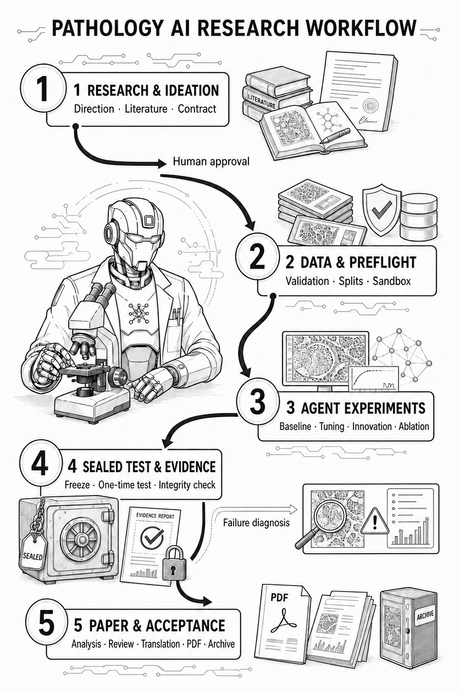

<div align="center">
  
  <h1>Pathology-AI-Scientist</h1>
  <p><b>An end-to-end AI research agent specialized for computational pathology.</b></p>
  <p>
    <a href="README.md">English</a> |
    <a href="README.zh-CN.md">简体中文</a>
  </p>
  <p>
    <a href="https://github.com/fearless239/pathology-ai-scientist/actions/workflows/ci.yml"></a>
    
    
    <a href="LICENSE"></a>
  </p>
  <p>
    <a href="#quick-start">Quick Start</a> ·
    <a href="docs/ARCHITECTURE.md">Architecture</a> ·
    <a href="#documentation">Documentation</a>
  </p>
</div>

Pathology-AI-Scientist is an end-to-end research-agent framework built on
[**AI-Scientist-v2**](https://github.com/SakanaAI/AI-Scientist-v2) and specialized for pathology AI
research. It carries a research direction through experiment design, code generation, execution,
evaluation, evidence collection, and manuscript production within one controlled workflow.

Many open AI-scientist frameworks present compelling general ideas, but deliberately remain open-ended:
they do not encode the dataset interfaces, evaluation rules, evidence requirements, and operational
controls needed for a concrete scientific domain. Pathology-AI-Scientist turns that general agentic
research paradigm into an executable workflow for computational pathology through:

- **Pathology-task specialization** for the structure and lifecycle of medical-image research.
- **Dataset adaptation** with explicit discovery, fingerprinting, split isolation, and test protection.
- **Scientific-rigor adaptation** with reproducible experiments, candidate freezing, trusted metrics,
  evidence provenance, and independent acceptance.
- **End-to-end agent execution** spanning research intent, experiments, analysis, and manuscript artifacts.

PathMNIST is the first supported reference dataset in the current beta release.

> **Note:**
> This repository is a `v0.1.0-beta` advanced research prototype. It distributes the executable
> framework, required upstream assets, configuration, deployment helpers, and regression tests.
> Historical experiment reports, generated papers, one-off recovery scripts, and private task evidence
> are kept outside the source distribution. Demo and mocked-test success do not constitute a new
> live-provider or sealed-test research run.

> **Caution!**
> Full Research Mode executes LLM-generated code. Run it only inside the provided restricted Docker
> environment and review every human-approval boundary. This software is not a medical device, clinical
> evidence, medical advice, or an autonomous clinical deployment system.

## Table of Contents

1. [Requirements](#requirements)
   - [Installation](#installation)
   - [Provider Configuration](#provider-configuration)
2. [Quick Start](#quick-start)
3. [Run a Pathology AI Research Task](#run-a-pathology-ai-research-task)
4. [Research Workflow](#research-workflow)
5. [Extending to New Datasets](#extending-to-new-datasets)
6. [Development and Verification](#development-and-verification)
7. [Frequently Asked Questions](#frequently-asked-questions)
8. [Documentation](#documentation)
9. [Acknowledgement](#acknowledgement)
10. [License and Responsible Use](#license-and-responsible-use)

## Requirements

The deterministic Demo Mode runs on Python 3.11 or 3.12 and does not require a dataset, GPU, or API key.
Full Research Mode requires:

- Python 3.11 or 3.12
- Docker
- Suitable compute for the selected experiment
- A verified supported dataset
- An explicitly authorized OpenAI-compatible provider

### Installation

Clone the repository and install the required feature set:

```bash
git clone https://github.com/fearless239/pathology-ai-scientist.git
cd pathology-ai-scientist
python -m venv .venv

# PowerShell: .\.venv\Scripts\Activate.ps1
# WSL/Linux: source .venv/bin/activate

python -m pip install -e ".[ui]"
```

For Full Research Mode, install the research, paper, and training dependencies:

```bash
python -m pip install -e ".[agent,ui,paper,training]"
```

### Provider Configuration

The framework reads `PARATERA_API_KEY` only from the process environment. `.env.example` documents the
supported variables, but never commit a populated `.env`.

Provider availability and nominal prices can change. Verify both before authorizing a paid run.

## Quick Start

The fastest way to explore the framework is the deterministic Demo Mode. It uses explicitly synthetic
fixture metrics and makes no network call after the Docker image is built.

```bash
docker compose up --build
```

Open <http://127.0.0.1:8501>.


The interface demonstrates research intent, the transactional Agent state graph, research-contract
approval, tool/budget/retry controls, trusted metrics, evidence provenance, and independent acceptance.

<details>
<summary><b>Windows with Docker Engine in WSL 2</b></summary>

Run Docker commands in the environment that owns the Docker Engine. For the validated Windows setup,
enter `Ubuntu-24.04` and build from the Windows checkout:

```bash
cd <WSL-PATH-TO-REPOSITORY>
bash scripts/build-demo-wsl.sh . path-ai-scientist-demo:local
bash scripts/verify-docker.sh path-ai-scientist-demo:local
```

See [Docker on Windows with WSL 2](docs/DOCKER_WSL.md) for launch commands, PowerShell invocation, and
the `xattr ... permission denied` workaround.

</details>

<details>
<summary><b>Run the Demo without Docker</b></summary>

```bash
path-ai-scientist-demo --output .demo/pathmnist-offline
PATH_SCIENTIST_DEMO=1 python -m streamlit run app.py
```

In PowerShell:

```powershell
$env:PATH_SCIENTIST_DEMO="1"; python -m streamlit run app.py
```

</details>

## Run a Pathology AI Research Task

Obtain PathMNIST from the official MedMNIST distribution (DOI `10.5281/zenodo.10519652`), retain its
attribution, and keep `pathmnist_64.npz` outside Git.

Create a task with a high-level pathology research direction:

```bash
path-ai-scientist init \
  --task-id TASK \
  --dataset-path pathmnist_64.npz \
  --direction "Describe the pathology AI research direction"

path-ai-scientist run --task-id TASK
path-ai-scientist status --task-id TASK
```

The orchestrator stops at explicit authorization boundaries. Inspect the current state and cost before
continuing:

```bash
path-ai-scientist approve-contract --task-id TASK
path-ai-scientist run --task-id TASK --allow-paid
path-ai-scientist approve-test --task-id TASK
path-ai-scientist run --task-id TASK --allow-test
path-ai-scientist run --task-id TASK --allow-paid
path-ai-scientist run --task-id TASK --allow-pdf
```

The former 24-stage workflow remains compatibility/regression code only. It is not shown in the main UI,
cannot grant formal acceptance, and is not a public control plane.

## Research Workflow

Pathology-AI-Scientist adapts the open-ended AI-scientist loop to the controls required by a concrete
pathology research task:

<div align="center">
  
</div>

Every formal transition follows:

```text
validate inputs → perform work → validate outputs → commit task state
```

A successful tool call does not complete a research stage. Missing manifests, untrusted statistics,
invalid references, exhausted budgets, or a violated test policy stop the workflow.

## Extending to New Datasets

The current beta provides one complete reference adapter. New pathology datasets can be integrated through
the beta contracts exposed by `pathmnist.framework`:

```python
from pathlib import Path
from pathmnist.dataset_adapter import DatasetAdapter as GenericImageDatasetAdapter

adapter = GenericImageDatasetAdapter(seed=7)
profile = adapter.discover(Path("my_dataset"), Path("dataset_profile.json"))
print(profile.content_sha256, profile.split_counts)
```

- `DatasetAdapter`: dataset discovery, description, fingerprinting, and split isolation.
- `ExperimentBackend`: preflight, experiment execution, candidate freeze, and sealed-test evaluation.
- `ArtifactValidator`: validation of manifests, trusted metrics, figures, references, and disclosures.
- `ResearchTaskConfig`: provider-neutral intent, adapter, budget, roles, permissions, and output root.

These interfaces define the intended extension seam but are not guaranteed stable before 1.0.

## Development and Verification

```bash
python -m pip install -e ".[dev]"
python -m ruff check path_ai_scientist pathmnist gate_a app.py
python -c "from pathlib import Path; Path('.test-tmp').mkdir(exist_ok=True)"
python -m pytest -q --basetemp .test-tmp/pytest
path-ai-scientist-release-check --repo .
path-ai-scientist-demo --output .demo/first
path-ai-scientist-demo --output .demo/second
```

The two Demo manifests must contain identical artifact hashes. Pull-request CI runs Python 3.11 and 3.12
checks, offline fixture acceptance, release-boundary checks, and Docker construction. GPU and paid-provider
smoke tests remain intentionally manual.

## Frequently Asked Questions

### Do I need a GPU or an API key?

Not for deterministic Demo Mode. Full Research Mode requires compute appropriate for the experiment and
an explicitly authorized compatible provider.

### Does a successful Demo prove the full live research pipeline works?

No. Demo Mode uses synthetic fixtures. Mocked and offline checks validate framework behavior but do not
constitute a new paid-provider, GPU, sealed-test, or publication run.

### Can this system be used for diagnosis or clinical decisions?

No. It is a research prototype, not a medical device or clinical evidence. Outputs require qualified
human review and independent validation.

### Which datasets are supported?

PathMNIST is the first complete reference adapter in the current beta. The framework contracts are intended
to support additional pathology datasets over time.

## Documentation

- [Architecture](docs/ARCHITECTURE.md)
- [Publication backend](docs/UPSTREAM_PUBLICATION.md)
- [Source provenance](docs/SOURCE_PROVENANCE.md)
- [Release checklist](docs/RELEASE_CHECKLIST.md)
- [Docker on Windows with WSL 2](docs/DOCKER_WSL.md)
- [Contributing](CONTRIBUTING.md), [security](SECURITY.md), and [third-party notices](THIRD_PARTY_NOTICES.md)

## Acknowledgement

Pathology-AI-Scientist is built on [AI-Scientist-v2](https://github.com/SakanaAI/AI-Scientist-v2).
The upstream snapshot and retained local patches are stored under `vendor/AI-Scientist-v2`.
`UPSTREAM_MANIFEST.sha256` records the original baseline. See [source provenance](docs/SOURCE_PROVENANCE.md)
for details.

## License and Responsible Use

This derivative repository retains the **AI Scientist Source Code License**, including restricted-use
conditions. It is source-available, not MIT-, Apache-, BSD-, or OSI-licensed. Review [LICENSE](LICENSE)
and [THIRD_PARTY_NOTICES.md](THIRD_PARTY_NOTICES.md) before redistribution.

Generated reports must retain prominent AI-generation disclosure. Do not use this software or its outputs
for diagnosis, treatment decisions, autonomous clinical deployment, or claims unsupported by qualified
human review and independently validated evidence.
