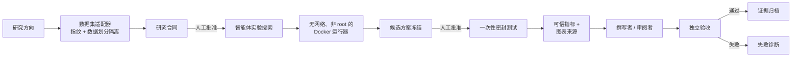

# Pathology-AI-Scientist


**一个可审计的计算病理学端到端科研智能体框架，以 PathMNIST 作为首个参考实现。**

Pathology-AI-Scientist 负责协调涉及大语言模型（LLM）、数据集、生成代码、Docker、GPU 实验、证据验证与论文工具的长周期研究任务。它的核心并非自动写论文，而是明确掌握：实际运行了什么、花费了多少、每项结果由哪些证据支持，以及系统何时必须停止并等待人工批准。

> **状态：**`v0.1.0-beta`，高级研究原型。本仓库依据受限制的 AI Scientist Source Code License **开放源代码访问（source-available）**，但并非 OSI 认可的开源软件。本项目不是医疗器械、临床证据、医疗建议或自主部署系统。


### Beta 验证边界

此版本保留现有研究实现、依赖版本和上游补丁。发布准备过程会重新验证已有的归档证据并运行离线回归测试，但不会重新运行付费研究或密封测试。Demo 或模拟测试通过，并不代表完成了一次新的真实服务端到端运行。较新的 `upstream_v2` 论文发布后端具有独立的离线测试覆盖；旧的归档任务不能证明该后端已经完成过实时研究任务。有关实测结果和尚未通过的发布门禁，请参阅[发布验证记录](docs/BETA_RELEASE_VALIDATION.md)及[论文发布验证限制](docs/UPSTREAM_PUBLICATION.md)。

## 五分钟快速体验

确定性的 Demo 模式不需要数据集、GPU 或 API 密钥；镜像构建完成后也不会发起网络调用。它使用明确标注的合成测试样例指标来展示控制界面。在 Windows 上，本项目支持将 Docker Engine 直接安装在 Ubuntu WSL 2 内，Docker Desktop 并非必需。

```bash
docker compose up --build
```

打开 <http://127.0.0.1:8501>。界面将依次展示研究意图、事务型智能体状态图、研究合同审批、工具/预算/重试控制、可信指标、证据来源，以及独立验收报告。

请在 Docker Engine 所属的环境中运行 Docker 命令。对于本仓库已验证的 Windows 配置，请进入 `Ubuntu-24.04`，并从 Windows 检出的仓库路径构建：

```bash
cd <仓库的-WSL-路径>
bash scripts/build-demo-wsl.sh . path-ai-scientist-demo:local
bash scripts/verify-docker.sh path-ai-scientist-demo:local
```

有关界面启动命令、PowerShell 调用方式以及 `xattr ... permission denied` 的解决办法，请参阅[在 Windows 上通过 WSL 2 使用 Docker](docs/DOCKER_WSL.md)。直接存放在 WSL Linux 文件系统中的全新克隆仓库，可以正常使用 `docker compose up --build`。

不使用 Docker 时，请使用 Python 3.11 或 3.12：

```bash
python -m venv .venv
# PowerShell：.\.venv\Scripts\Activate.ps1
# WSL/Linux：source .venv/bin/activate
python -m pip install -e ".[ui]"
path-ai-scientist-demo --output .demo/pathmnist-offline
PATH_SCIENTIST_DEMO=1 python -m streamlit run app.py
```

在 PowerShell 中，最后一条命令应写为：`$env:PATH_SCIENTIST_DEMO="1"; python -m streamlit run app.py`。

## 为什么科研智能体比聊天智能体更难

仅仅给出一个看似合理的答案是不够的。研究工作流必须能够从中断中恢复、隔离测试集、核算服务商成本、执行不受信任的生成代码、区分模型声明与实测结果，并在证据不完整时拒绝发布。Pathology-AI-Scientist 将这些要求实现为系统不变量，而不是提示词建议。



每一次正式状态转换都遵循：

```text
验证输入 → 执行工作 → 验证输出 → 提交任务状态
```

工具成功返回并不代表某个阶段已经完成。清单缺失、统计数据不可信、引用无效、预算耗尽或违反测试策略，都会使工作流停止。

## 工程亮点

- **持久化编排：**事务型状态、有限重试、回滚、恢复，以及幂等响应复用。
- **人工参与控制：**研究合同、付费调用、密封测试和 PDF 构建分别需要独立批准。
- **安全执行生成代码：**使用非 root Docker、禁用网络、限制挂载，并且实验环境中不包含 API 密钥。
- **成本治理：**请求预留、持久化任务账本、稳定的请求 ID，以及不可突破的预算上限。
- **科研诚信：**数据划分隔离、候选方案冻结、一次性测试评估、重复实验要求、可信统计和完整结果报告。
- **证据来源追踪：**数据集、代码、执行、指标、图表、声明和归档的哈希值均可由机器验证。
- **独立验收：**由确定性验证器而非论文撰写者决定输出能否被称为正式研究成果。

## PathMNIST 案例研究

经过整理的参考案例展示了冻结版 SmallResNet 在三个随机种子下的评估。它记录了测试集 Macro-F1 `0.834035 ± 0.075947`、验证集/测试集对比、每个随机种子的结果，以及复现报告所需的来源信息。该案例用于演示框架，而非宣称达到当前最佳水平或具备临床价值。

请阅读[案例研究](docs/CASE_STUDY.md)，或查看[已去标识化的证据包](examples/pathmnist-case-study/README.md)。生成的论文只是非核心、明确标注未经同行评审的示例；验收报告和证据清单才是事实依据。

## 框架扩展边界

`pathmnist.framework` 提供 Beta 版 `Protocol` 协议：

```python
from pathlib import Path
from pathmnist.dataset_adapter import DatasetAdapter as GenericImageDatasetAdapter

adapter = GenericImageDatasetAdapter(seed=7)
profile = adapter.discover(Path("my_dataset"), Path("dataset_profile.json"))
print(profile.content_sha256, profile.split_counts)
```

- `DatasetAdapter`：发现、描述数据集，为其生成指纹，并隔离各数据划分。
- `ExperimentBackend`：执行预检与实验、冻结候选方案，并评估密封测试。
- `ArtifactValidator`：验证清单、可信指标、图表、引用和披露信息。
- `ResearchTaskConfig`：与服务商无关的研究意图、适配器、预算、角色、权限和输出根目录配置。

PathMNIST 是 Beta 版本中唯一完整的参考适配器。这些接口描述了预期的扩展边界，但在 1.0 版本之前不保证稳定。

## 完整研究模式

完整模式需要经过验证的 PathMNIST-64 压缩包、Docker、适当的计算资源，以及获得明确授权且兼容 OpenAI 接口的服务商。请从 MedMNIST 官方发行渠道获取 PathMNIST（DOI：`10.5281/zenodo.10519652`），保留其署名信息，并将 `pathmnist_64.npz` 存放在 Git 仓库之外。

```bash
python -m pip install -e ".[agent,ui,paper,training]"
path-ai-scientist init --task-id TASK --dataset-path pathmnist_64.npz --direction "..."
path-ai-scientist run --task-id TASK
path-ai-scientist status --task-id TASK
```

编排器会在授权边界处停止。只有在检查状态和成本后，才能继续执行：

```bash
path-ai-scientist approve-contract --task-id TASK
path-ai-scientist run --task-id TASK --allow-paid
path-ai-scientist approve-test --task-id TASK
path-ai-scientist run --task-id TASK --allow-test
path-ai-scientist run --task-id TASK --allow-paid
path-ai-scientist run --task-id TASK --allow-pdf
```

系统只从进程环境读取 `PARATERA_API_KEY`。`.env.example` 列出了支持的变量，但绝不能提交已填入内容的 `.env`。进行付费运行前，必须核实服务商目录及标称价格。

原有的 24 阶段工作流仅作为兼容性/回归测试代码保留。它不会显示在主界面中，不能授予正式验收，也不是公共控制平面。

## 与 AI-Scientist-v2 的差异化

| 关注点 | 上游 AI-Scientist-v2 | Pathology-AI-Scientist 的专门实现 |
|---|---|---|
| 智能体搜索 | AgentManager、MinimalAgent、日志 | 病理学研究合同与受控状态转换 |
| 数据集 | 通用实验假设 | 指纹、分组/划分检查、物理隔离的研究集/测试集视图 |
| 生成代码 | 由智能体管理实验 | 无网络、非 root 运行器及执行凭证 |
| 测试策略 | 无本地密封测试权限控制 | 候选方案冻结、持久化审批、一次性评估 |
| 证据 | 日志与生成报告 | 可信统计、清单、哈希和声明约束 |
| 成本 | 服务商调用 | 预留账本和不可突破的任务预算 |
| 发布 | 撰写者/审阅者概念 | 图表/引用/披露/PDF 门禁与失败诊断 |

上游代码快照及现有本地补丁保留在 `vendor/AI-Scientist-v2` 下。`UPSTREAM_MANIFEST.sha256` 记录的是未经补丁修改的原始基线，而不是已打补丁的代码树。详情请参阅[架构](docs/ARCHITECTURE.md)和[源代码来源](docs/SOURCE_PROVENANCE.md)。

## 开发与验证

```bash
python -m pip install -e ".[dev]"
python -m ruff check path_ai_scientist pathmnist gate_a app.py
python -c "from pathlib import Path; Path('.test-tmp').mkdir(exist_ok=True)"
python -m pytest -q --basetemp .test-tmp/pytest
path-ai-scientist-release-check --repo .
path-ai-scientist-demo --output .demo/first
path-ai-scientist-demo --output .demo/second
```

两个 Demo 清单必须包含完全相同的产物哈希。拉取请求 CI 会运行 Python 3.11 和 3.12 检查、离线测试样例验收、发布边界检查和 Docker 构建。GPU 与付费服务商冒烟测试有意设置为手动执行。

## 已知限制

- 已验证的示例是 PathMNIST 图像块分类，而不是全切片成像。
- 三个随机种子的基准测试不等同于外部复现或临床验证。
- 生成的论文需要由合格人员审核，默认情况下不能直接发表。
- 上游 `AgentManager` 的恢复机制仍使用任务自身的 pickle 状态；替换该机制属于 P1 工作。
- Docker/WSL 上手配置比托管 Demo 更复杂，而此 Beta 版本有意不提供托管 Demo。
- 服务商可用性和标称价格可能变化，使用前必须进行检查。

## 文档

- [工程深度解析](docs/ENGINEERING_DEEP_DIVE.md)
- [案例研究](docs/CASE_STUDY.md)
- [在 Windows 上通过 WSL 2 使用 Docker](docs/DOCKER_WSL.md)
- [架构](docs/ARCHITECTURE.md)、[Beta 审计](docs/BETA_AUDIT.md)和[发布检查清单](docs/RELEASE_CHECKLIST.md)
- [贡献指南](CONTRIBUTING.md)、[安全说明](SECURITY.md)和[第三方声明](THIRD_PARTY_NOTICES.md)

## 许可证与负责任使用

本衍生仓库继续采用包含用途限制条款的 **AI Scientist Source Code License**。不得将其描述为采用 MIT、Apache、BSD 或任何 OSI 认可的许可证。重新分发前，请阅读 [LICENSE](LICENSE) 和 [THIRD_PARTY_NOTICES.md](THIRD_PARTY_NOTICES.md)。

生成的报告必须保留醒目的 AI 生成内容披露。请勿将本软件或其输出用于诊断、治疗决策、自主临床部署，或提出未经合格人员审核与独立验证证据支持的声明。
