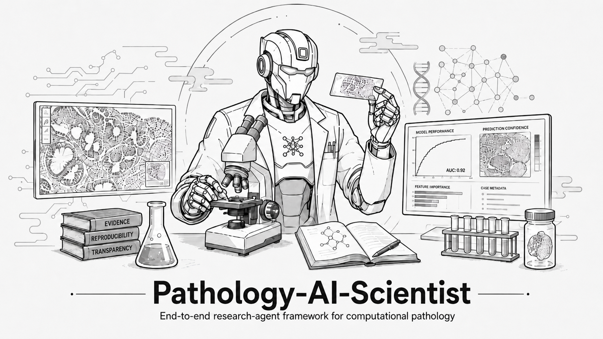
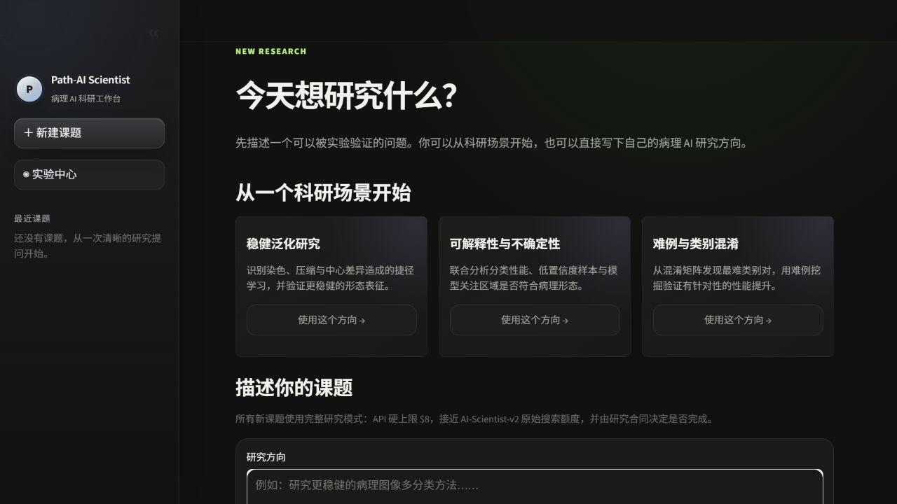
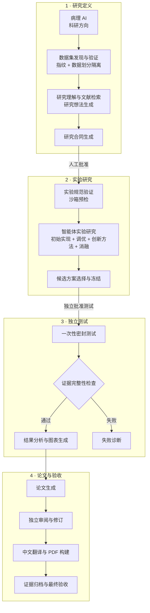

<div align="center">
  
  <h1>Pathology-AI-Scientist</h1>
  <p><b>面向计算病理学的端到端 AI 科研智能体。</b></p>
  <p>
    <a href="README.md">English</a> |
    <a href="README.zh-CN.md">简体中文</a>
  </p>
  <p>
    <a href="https://github.com/fearless239/pathology-ai-scientist/actions/workflows/ci.yml"></a>
    
    
    <a href="LICENSE"></a>
  </p>
  <p>
    <a href="#快速开始">快速开始</a> ·
    <a href="docs/ARCHITECTURE.md">系统架构</a> ·
    <a href="docs/CASE_STUDY.md">案例研究</a> ·
    <a href="#文档">文档</a>
  </p>
</div>

Pathology-AI-Scientist 是一个基于
[**AI-Scientist-v2**](https://github.com/SakanaAI/AI-Scientist-v2)、针对病理 AI 科研任务进行特化的
端到端科研智能体框架。它在一个受控工作流中，将研究方向依次推进至实验设计、代码生成、实验执行、
结果评估、证据收集和论文生成。

目前已有许多开源 AI 科学家框架提出了很有吸引力的通用思路，但这些框架通常有意保持开放：它们并未
落实具体科研领域所需要的数据集接口、评估规则、证据要求和操作控制。Pathology-AI-Scientist 通过
以下适配，将通用的智能体科研范式落实为可执行的计算病理学研究工作流：

- **病理科研任务特化：**面向医学图像研究的任务结构和完整研究生命周期。
- **数据集适配：**明确的数据发现、指纹生成、数据划分隔离和测试集保护。
- **科研严谨性适配：**可复现实验、候选方案冻结、可信指标、证据来源追踪和独立验收。
- **端到端智能体执行：**覆盖研究意图、实验、结果分析和论文成果的完整流程。

PathMNIST 是当前 Beta 版本支持的首个参考数据集。

> **说明：**
> 本仓库是 `v0.1.0-beta` 高级研究原型。当前验证边界记录在
> [发布验证报告](docs/BETA_RELEASE_VALIDATION.md)中。Demo 或模拟测试通过，并不构成一次新的真实
> 服务商或密封测试研究运行。

> **注意！**
> 完整研究模式会执行 LLM 生成的代码。请仅在项目提供的受限 Docker 环境中运行，并审查每个人工
> 审批边界。本软件不是医疗器械、临床证据、医疗建议或自主临床部署系统。

## 目录

1. [运行要求](#运行要求)
   - [安装](#安装)
   - [服务商配置](#服务商配置)
2. [快速开始](#快速开始)
3. [运行病理 AI 科研任务](#运行病理-ai-科研任务)
4. [研究工作流](#研究工作流)
5. [扩展新的数据集](#扩展新的数据集)
6. [开发与验证](#开发与验证)
7. [常见问题](#常见问题)
8. [文档](#文档)
9. [致谢](#致谢)
10. [许可证与负责任使用](#许可证与负责任使用)

## 运行要求

确定性的 Demo 模式可以在 Python 3.11 或 3.12 上运行，不需要数据集、GPU 或 API 密钥。完整研究
模式需要：

- Python 3.11 或 3.12
- Docker
- 与所选实验相适应的计算资源
- 经过验证且受支持的数据集
- 获得明确授权、兼容 OpenAI 接口的服务商

### 安装

克隆仓库并安装需要的功能组件：

```bash
git clone https://github.com/fearless239/pathology-ai-scientist.git
cd pathology-ai-scientist
python -m venv .venv

# PowerShell: .\.venv\Scripts\Activate.ps1
# WSL/Linux: source .venv/bin/activate

python -m pip install -e ".[ui]"
```

如需使用完整研究模式，请安装智能体、论文和训练依赖：

```bash
python -m pip install -e ".[agent,ui,paper,training]"
```

### 服务商配置

框架只从进程环境中读取 `PARATERA_API_KEY`。`.env.example` 记录了支持的变量，但绝不能提交已经填入
内容的 `.env`。

服务商可用性和标称价格可能发生变化。在授权付费运行前，请核实这两项信息。

## 快速开始

确定性的 Demo 模式是体验本框架的最快方式。它使用明确标注的合成测试样例指标，并且在 Docker 镜像
构建完成后不会发起网络调用。

```bash
docker compose up --build
```

打开 <http://127.0.0.1:8501>。



界面展示研究意图、事务型智能体状态图、研究合同审批、工具/预算/重试控制、可信指标、证据来源追踪
和独立验收。

<details>
<summary><b>在 Windows 上通过 WSL 2 使用 Docker Engine</b></summary>

请在 Docker Engine 所属的环境中运行 Docker 命令。对于经过验证的 Windows 配置，请进入
`Ubuntu-24.04`，并从 Windows 检出的仓库路径构建：

```bash
cd <WSL-PATH-TO-REPOSITORY>
bash scripts/build-demo-wsl.sh . path-ai-scientist-demo:local
bash scripts/verify-docker.sh path-ai-scientist-demo:local
```

有关启动命令、PowerShell 调用方式以及 `xattr ... permission denied` 的解决办法，请参阅
[在 Windows 上通过 WSL 2 使用 Docker](docs/DOCKER_WSL.md)。

</details>

<details>
<summary><b>不使用 Docker 运行 Demo</b></summary>

```bash
path-ai-scientist-demo --output .demo/pathmnist-offline
PATH_SCIENTIST_DEMO=1 python -m streamlit run app.py
```

在 PowerShell 中：

```powershell
$env:PATH_SCIENTIST_DEMO="1"; python -m streamlit run app.py
```

</details>

## 运行病理 AI 科研任务

请从 MedMNIST 官方发行渠道获取 PathMNIST（DOI：`10.5281/zenodo.10519652`），保留其署名信息，
并将 `pathmnist_64.npz` 存放在 Git 仓库之外。

使用一个高层次的病理科研方向创建任务：

```bash
path-ai-scientist init \
  --task-id TASK \
  --dataset-path pathmnist_64.npz \
  --direction "描述病理 AI 科研方向"

path-ai-scientist run --task-id TASK
path-ai-scientist status --task-id TASK
```

编排器会在明确的授权边界处停止。在继续运行之前，请检查当前状态和成本：

```bash
path-ai-scientist approve-contract --task-id TASK
path-ai-scientist run --task-id TASK --allow-paid
path-ai-scientist approve-test --task-id TASK
path-ai-scientist run --task-id TASK --allow-test
path-ai-scientist run --task-id TASK --allow-paid
path-ai-scientist run --task-id TASK --allow-pdf
```

原有的 24 阶段工作流仅作为兼容性/回归测试代码保留。它不会显示在主界面中，不能授予正式验收，
也不是公共控制平面。

## 研究工作流

Pathology-AI-Scientist 将开放式的 AI 科学家循环，适配为具体病理科研任务所需要的受控流程：



每一次正式状态转换都遵循：

```text
验证输入 → 执行工作 → 验证输出 → 提交任务状态
```

工具成功返回并不代表某个研究阶段已经完成。清单缺失、统计数据不可信、引用无效、预算耗尽或违反
测试策略，都会使工作流停止。

## 扩展新的数据集

当前 Beta 版本提供了一个完整的参考适配器。新的病理数据集可以通过 `pathmnist.framework` 提供的
Beta 接口进行集成：

```python
from pathlib import Path
from pathmnist.dataset_adapter import DatasetAdapter as GenericImageDatasetAdapter

adapter = GenericImageDatasetAdapter(seed=7)
profile = adapter.discover(Path("my_dataset"), Path("dataset_profile.json"))
print(profile.content_sha256, profile.split_counts)
```

- `DatasetAdapter`：数据集发现、描述、指纹生成和数据划分隔离。
- `ExperimentBackend`：预检、实验执行、候选方案冻结和密封测试评估。
- `ArtifactValidator`：验证清单、可信指标、图表、引用和披露信息。
- `ResearchTaskConfig`：与服务商无关的研究意图、适配器、预算、角色、权限和输出根目录。

这些接口定义了预期的扩展边界，但在 1.0 版本之前不保证稳定。

## 开发与验证

```bash
python -m pip install -e ".[dev]"
python -m ruff check path_ai_scientist pathmnist gate_a app.py
python -c "from pathlib import Path; Path('.test-tmp').mkdir(exist_ok=True)"
python -m pytest -q --basetemp .test-tmp/pytest
path-ai-scientist-release-check --repo .
path-ai-scientist-demo --output .demo/first
path-ai-scientist-demo --output .demo/second
```

两个 Demo 清单必须包含完全相同的产物哈希。拉取请求 CI 会运行 Python 3.11 和 3.12 检查、离线测试
样例验收、发布边界检查和 Docker 构建。GPU 与付费服务商冒烟测试有意设置为手动执行。

## 常见问题

### 是否需要 GPU 或 API 密钥？

确定性的 Demo 模式不需要。完整研究模式需要与实验相适应的计算资源，以及获得明确授权的兼容服务商。

### Demo 成功是否证明完整的真实研究流程可以运行？

不能。Demo 模式使用合成测试样例。模拟与离线检查可以验证框架行为，但不构成新的付费服务商、GPU、
密封测试或论文发布运行。

### 本系统能否用于诊断或临床决策？

不能。本项目是研究原型，不是医疗器械或临床证据。所有输出都需要合格人员审查与独立验证。

### 支持哪些数据集？

PathMNIST 是当前 Beta 版本的首个完整参考适配器。框架接口计划逐步支持更多病理数据集。

## 文档

- [系统架构](docs/ARCHITECTURE.md)
- [工程深度解析](docs/ENGINEERING_DEEP_DIVE.md)
- [案例研究](docs/CASE_STUDY.md)
- [发布验证](docs/BETA_RELEASE_VALIDATION.md)
- [在 Windows 上通过 WSL 2 使用 Docker](docs/DOCKER_WSL.md)
- [贡献指南](CONTRIBUTING.md)、[安全说明](SECURITY.md)和[第三方声明](THIRD_PARTY_NOTICES.md)

## 致谢

Pathology-AI-Scientist 基于 [AI-Scientist-v2](https://github.com/SakanaAI/AI-Scientist-v2) 构建。
上游代码快照及保留的本地补丁存放在 `vendor/AI-Scientist-v2` 下。`UPSTREAM_MANIFEST.sha256` 记录
原始基线。详情请参阅[源代码来源](docs/SOURCE_PROVENANCE.md)。

## 许可证与负责任使用

本衍生仓库继续采用包含用途限制条款的 **AI Scientist Source Code License**。本项目开放源代码访问
（source-available），但不采用 MIT、Apache、BSD 或任何 OSI 认可的许可证。重新分发前，请阅读
[LICENSE](LICENSE) 和 [THIRD_PARTY_NOTICES.md](THIRD_PARTY_NOTICES.md)。

生成的报告必须保留醒目的 AI 生成内容披露。请勿将本软件或其输出用于诊断、治疗决策、自主临床
部署，或提出未经合格人员审核与独立验证证据支持的声明。
