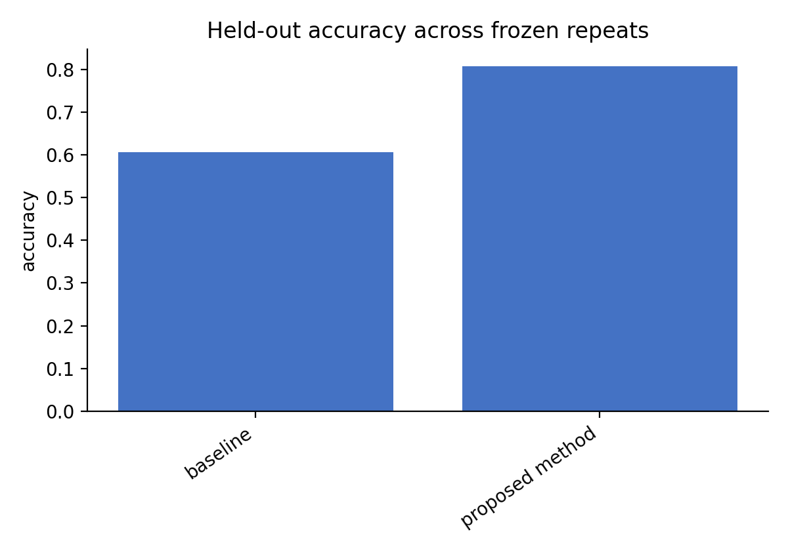
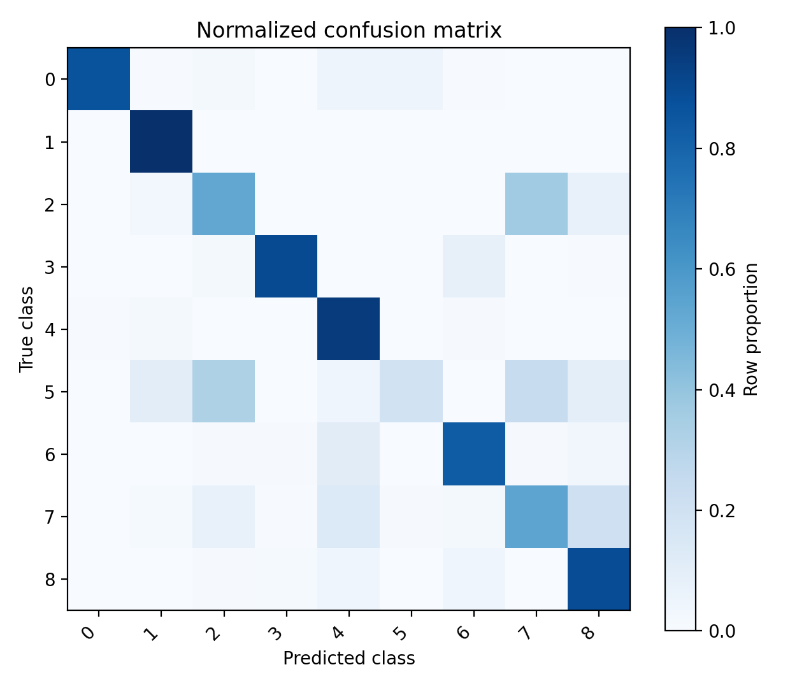

# `pathtest-001`: Historical End-to-End PathMNIST Run

> **Evidence boundary:** This is a curated, historical case study completed on 2026-08-28 and
> revalidated with commit `887bafd` on 2026-09-01. It demonstrates that one real task reached the
> archived state and still satisfies the current acceptance validator. It does **not** claim that
> the current commit was freshly rerun end to end.

## What completed

`pathtest-001` evaluated label smoothing in a lightweight three-convolution-layer CNN trained from
scratch on PathMNIST. The task completed the controlled workflow from dataset validation and research
contract approval through generated experiments, candidate freezing, one authorized held-out test,
analysis, figures, writing, independent review, revision, translation, PDF QA, and archive acceptance.

The current validator was run with `--target-stage archived --require-pdf` and returned no errors or
warnings. The machine-readable result is in [acceptance_report.json](acceptance_report.json).

## Descriptive results

| Split | Metric | Baseline | Label smoothing | Difference |
|---|---:|---:|---:|---:|
| Validation | Accuracy | 0.7383 | 0.8150 | +0.0767 |
| Validation | Macro-F1 | 0.7084 | 0.8186 | +0.1102 |
| Held-out test | Accuracy | 0.6065 | 0.8075 | +0.2010 |
| Held-out test | Macro-F1 | 0.5806 | 0.7314 | +0.1508 |

The protocol used one seed and descriptive-only analysis. These values do not provide confidence
intervals, statistical significance, or repeat stability. The unusually weak baseline test result may
reflect underfitting or training instability, so the large observed difference must not be presented as
confirmed evidence that label smoothing generally produces this effect.

## Included evidence

- [English final paper](papers/final_paper_en.pdf)
- [Chinese final paper](papers/final_paper_zh-CN.pdf)
- [Task summary](task_summary.json)
- [Research contract summary](research_contract_summary.json)
- [Experiment manifest](experiment_manifest.json)
- [Result summary](results.json)
- [Curated-file manifest](showcase_manifest.json)

The papers are AI-generated, not peer reviewed, and require qualified human review. They are included
as workflow artifacts rather than as scientific or clinical validation.

## Deliberately excluded

The original task directory is about 2.46 GB and is not published. This case study excludes the
PathMNIST arrays, sealed test view, model weights, checkpoints, pickle state, raw predictions, original
LLM requests and responses, logs, caches, recovery backups, compilation intermediates, execution
receipts, local filesystem paths, and the 1.18 GB evidence archive. The published files cannot be used
to reconstruct the dataset or resume the historical task.

## 中文说明

这是一个在 2026-08-28 完成、并于 2026-09-01 使用当前提交 `887bafd` 重新通过验收的历史端到端
案例。它证明曾有一个真实任务完成数据验证、研究合同审批、实验生成与执行、候选方案冻结、一次获批的
密封测试、分析、制图、论文撰写、独立审阅、修订、翻译、PDF 质量检查和归档。

该案例不能表述为“当前版本刚刚重新完整运行了一次”。实验只有一个随机种子，统计方案为描述性分析；
同时基线测试准确率异常偏低，因此结果不能被宣传为标签平滑具有普遍、确定的 20.1 个百分点提升。

公开目录只包含脱敏摘要、代表图和中英文最终论文。数据集、模型权重、checkpoint、pickle、原始模型
响应、日志、运行回执、本机路径和完整证据压缩包均未上传。两份论文由 AI 大量辅助生成、未经同行评审，
仅作为工作流产物展示，不构成科研结论或临床证据。
