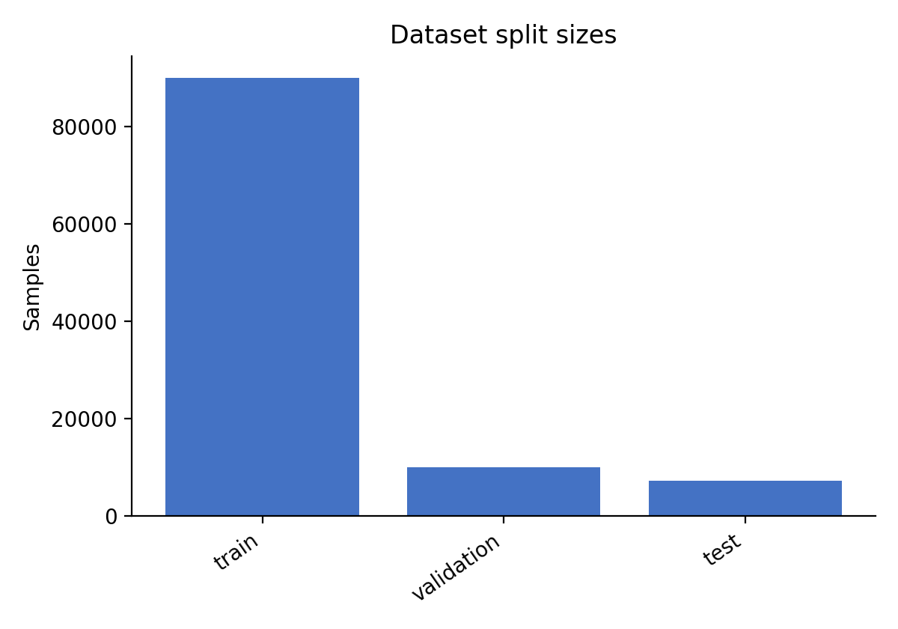
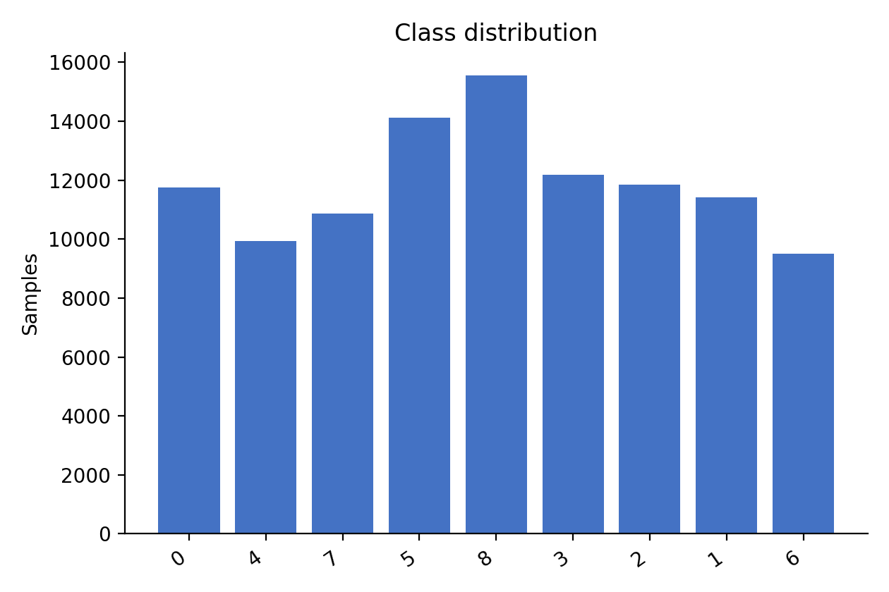
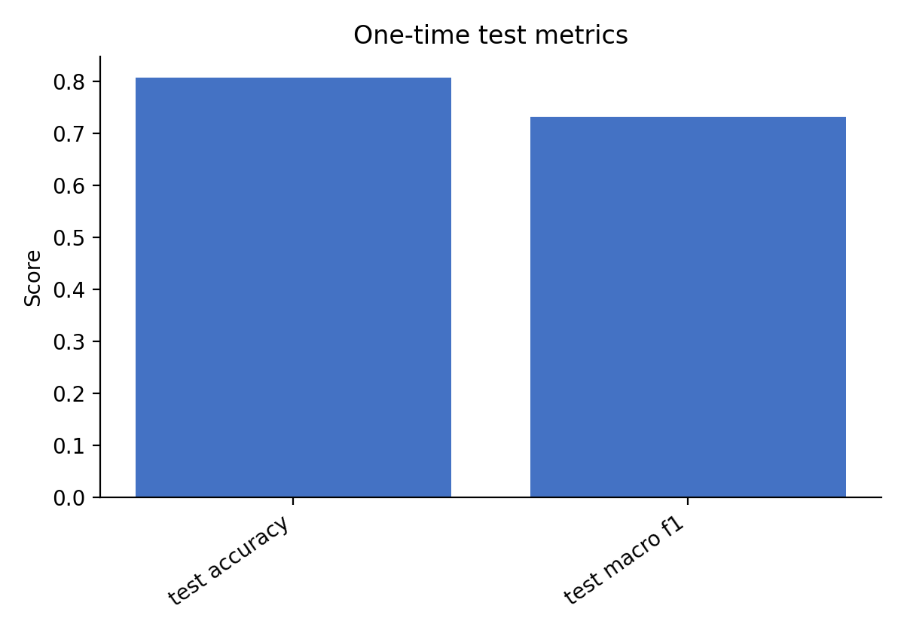
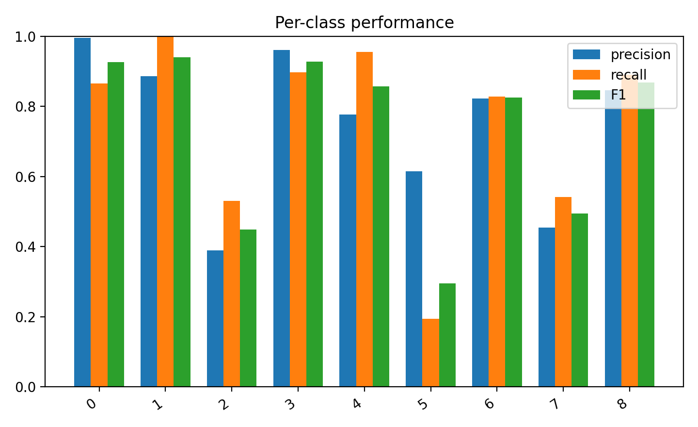
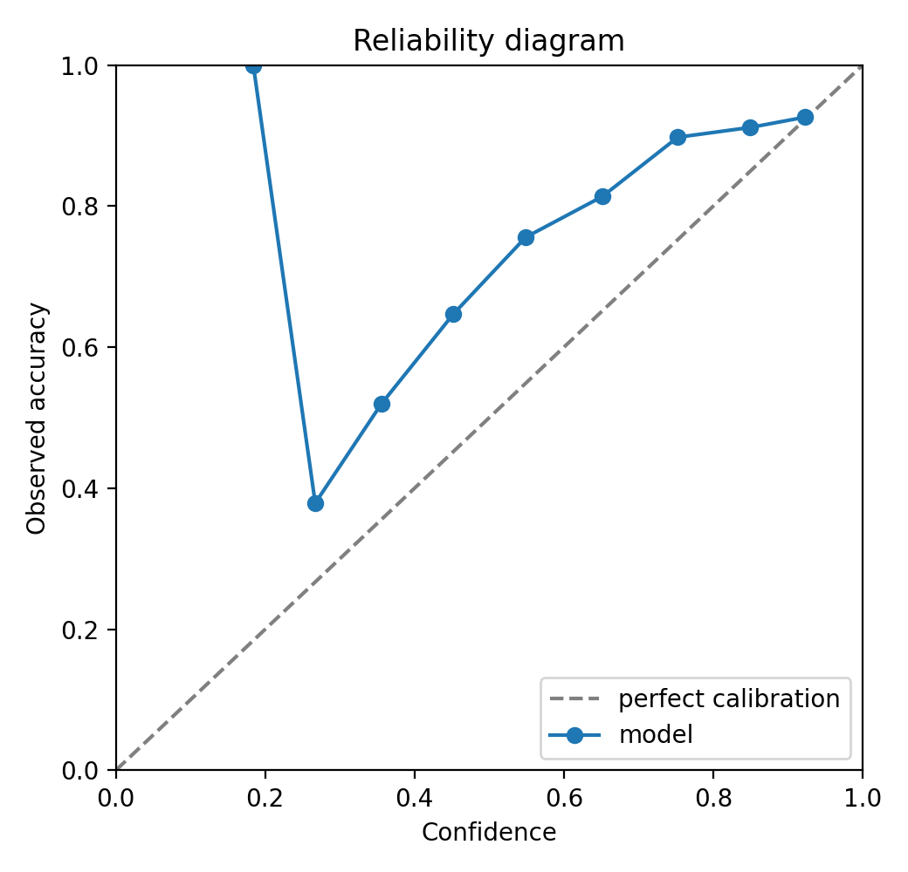
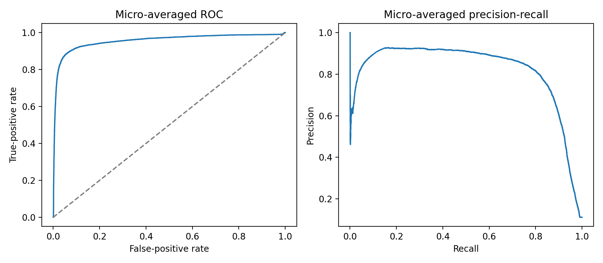

# Label Smoothing Improves a Lightweight CNN for Histopathology Image Classification on PathMNIST

## Abstract

We investigate whether label smoothing cross-entropy loss can improve the classification accuracy of a lightweight convolutional neural network (CNN) trained from scratch on the PathMNIST histopathology dataset. Following a pre-specified research protocol, we trained a 3-convolutional-layer CNN on 28×28 histopathology images using standard cross-entropy loss (baseline) and label smoothing cross-entropy loss (intervention). The model and hyperparameters were selected on a validation set, after which the final model was evaluated once on a held-out test set. On the validation set, the intervention achieved an accuracy of 0.8150 compared to the baseline's 0.7383, yielding a paired mean difference of 0.0767. This improvement exceeded the pre-specified threshold of a 1.0-percentage-point increase and satisfied the macro-F1 non-decrease guardrail. On the held-out test set, the intervention achieved an accuracy of 0.8075 compared to the baseline's 0.6065, yielding a paired mean difference of 0.2010. Because the statistical plan specified a single repeat with descriptive-only analysis, these comparisons lack paired uncertainty estimates and are therefore descriptive only.

## Dataset

This study used the PathMNIST dataset [R1, R2], a benchmark collection of histopathology images for nine-class patch-level tissue classification. The dataset was provided with a fixed split of 89,996 training images, 10,004 validation images, and 7,180 test images. The source images have a shape of 64×64×3 pixels. For the purposes of this experiment, images were resized to a model input resolution of 28×28 pixels; the source images were not originally at this resolution. The nine classes are represented by integer labels 0 through 8.

The class distribution varies across splits. The training set is dominated by classes 8 (n=12,885) and 5 (n=12,182), while the test set is more imbalanced, with class 8 (n=1,233) and class 0 (n=1,338) being the most frequent, and class 2 (n=339) and class 5 (n=592) being the least frequent.

## Related Work

Histopathology image classification has attracted significant attention for its potential to support computer-aided diagnosis [11]. Recent literature explores a range of architectures, from lightweight CNNs designed for efficiency [12] to pretrained models and transfer learning strategies [R2, R6]. Comparative analyses have benchmarked CNN performance across different frameworks [4] and against transformer-based models [11]. 

Specific methodological approaches include curvature regularization for robust classification [3], text-augmented visual prompt learning [9], and continual learning under class-incremental scenarios [10]. Studies have also examined the impact of color spaces [7] and multiscale feature integration [8]. This work builds on the baseline CNN literature by evaluating a simple regularization technique—label smoothing—on a lightweight architecture trained from scratch.

## Methods

### Model Architecture
The model is a lightweight CNN comprising three convolutional layers, trained from scratch without any external or pretrained weights. The network accepts input images of size 28×28×3.

### Training Objective
The baseline intervention used standard cross-entropy loss. The proposed intervention replaced this with label smoothing cross-entropy loss, which mixes the hard target distribution with a uniform distribution over the nine classes using a smoothing factor of 0.15. This method adds negligible computational overhead per training step. The CNN architecture and all other hyperparameters remained identical between the baseline and intervention groups.

### Hyperparameters and Selection
Hyperparameters were determined using a 20% subset of the training set to reduce experimental runtime. The selected parameters were: optimizer: SGD; learning rate: 0.01; batch size: 128; weight decay: 0.0005; momentum: 0.9. The model was trained for a maximum of 12 epochs. Early stopping was enabled with a patience of 5 epochs, monitoring validation loss with a minimum delta of 0.0. Checkpoint selection was based on minimizing validation loss. The primary metric for selection was accuracy, and the model was selected based on its performance on the validation set. After hyperparameter selection on the 20% subset, the final baseline and intervention models were trained on the full training set and evaluated on the validation set.

## Experimental Protocol

The research protocol pre-specified a single comparison between the baseline (standard cross-entropy) and the intervention (label smoothing cross-entropy). The primary metric was defined as nine-class classification accuracy, with a pre-specified success criterion requiring an accuracy improvement of at least 0.01 (1 percentage point) for the intervention relative to the baseline. A guardrail was established requiring no decrease in macro-F1.

The experiment utilized a fixed data split (split seed 7) and a single training seed (seed 0). The statistical plan was configured for descriptive analysis only, with a single repeat; thus, no inferential significance tests or confidence intervals were computed. The final model and analysis protocol were fixed before a single evaluation on the held-out test set. The held-out test results were independently recomputed and were not used for model selection.

## Results

On the validation set, the intervention achieved an accuracy of 0.8150 and a macro-F1 of 0.8186, compared to the baseline's accuracy of 0.7383 and macro-F1 of 0.7084. The paired mean difference in accuracy was 0.0767, and the macro-F1 guardrail was met with a delta of 0.1102. 

On the held-out test set, the intervention achieved an accuracy of 0.8075 and a macro-F1 of 0.7314, compared to the baseline's accuracy of 0.6065. The paired mean difference in test accuracy was 0.2010. Per-class performance on the test set revealed high precision and recall for classes 0, 1, 3, and 4, but lower performance for classes 2, 5, and 7. For instance, test class 5 exhibited a recall of 0.1943, and test class 2 exhibited a precision of 0.3896.

## Discussion

The pre-specified hypothesis was that label smoothing would improve classification accuracy by at least 1 percentage point over standard cross-entropy without decreasing macro-F1. According to the contract results, this hypothesis was supported on the validation set. The validation improvement of 7.67 percentage points substantially exceeded the 1.0-percentage-point threshold, and the macro-F1 guardrail was satisfied. On the held-out test set, the intervention maintained a strong advantage over the baseline, with a paired mean difference of 20.10 percentage points in favor of label smoothing.

The descriptive results suggest that label smoothing may have reduced model overconfidence and improved generalization on this lightweight architecture, though this is a descriptive hypothesis rather than a confirmed causal conclusion. However, the test set performance highlights specific challenges. The model struggled with classes 2, 5, and 7, which may be attributable to visual similarities between certain tissue types or the reduced representation of classes 2 and 5 in the test set. The low recall for class 5 (0.1943) indicates that the model frequently misclassified these samples, often confusing them with classes 2 and 7, as seen in the confusion matrix. The systematic misrouting of samples among these classes suggests that the 28×28 downsampling, which discards approximately 75% of the pixel information from the 64×64 source images, may be a primary driver of inter-class confusion by obliterating fine-grained histological detail. Additionally, the baseline test accuracy of 0.6065 is anomalously low for a 9-class task, suggesting possible training instability or underfitting; thus, the large intervention gain may partly reflect baseline pathology rather than the isolated efficacy of label smoothing.

## Limitations

This study has several limitations. First, the statistical plan specified only a single repeat; therefore, any comparison without paired uncertainty estimates is descriptive only, and no inferential significance or repeat stability can be claimed. Results may change with different random seeds, and multi-seed replication is needed to verify the robustness of these findings. Second, the held-out test result was not used for tuning or model selection, meaning the reported test metrics are a single snapshot of performance. Third, the claim boundary is strictly limited to supervised patch-level image classification; no clinical or patient-level claims are made. Fourth, the model was trained on 28×28 images resized from a 64×64 source, which may result in the loss of fine-grained histological detail. Fifth, the label smoothing factor (α=0.15) was selected without a sensitivity analysis or ablation across alternative values (e.g., α ∈ {0.05, 0.10, 0.20}), leaving it unclear whether the improvement is robust to this choice. Finally, the anomalously low baseline test accuracy suggests possible underfitting, meaning the comparative improvement may reflect baseline training failure rather than the intrinsic benefit of label smoothing.

## Conclusion

In this completed study, we evaluated a lightweight 3-convolutional-layer CNN trained from scratch on PathMNIST. The pre-specified hypothesis that label smoothing cross-entropy loss would improve accuracy by at least 1 percentage point over standard cross-entropy was supported on the validation set, with a paired mean difference of 0.0767, and the macro-F1 non-decrease guardrail was met. The final model, selected on validation data and evaluated once on a held-out test set, achieved a test accuracy of 0.8075, representing a descriptive paired mean difference of 0.2010 over the baseline. These findings suggest that label smoothing is a beneficial, low-overhead regularization technique for lightweight CNNs in histopathology image classification.

## AI Assistance Disclosure

**AI-generation disclosure:** This manuscript was generated with substantial assistance from Path-AI Scientist, a derivative workflow built on AI-Scientist-v2. All claims and artifacts require human review.

## References

* **[1]** Junia Sam Dani, P.Joyce Beryl Princess. "Comparative Study of Baseline CNNs and Meta-Learning Approaches on PathMNIST" *2025 International Conference on Sustainable Communication Networks and Application (ICSCN)* (2025). DOI: 10.1109/icscn67106.2025.11308359. URL: https://doi.org/10.1109/icscn67106.2025.11308359
* **[2]** Chakinarapu Sreenidhi, B. Surendiran, B. Prema Mayudu, P. V. S. S. R. Chandra Mouli, et al.. "Histopathological Image Classification on PathMNIST Using Pretrained CNN Models" *Lecture Notes in Networks and Systems* (2026). DOI: 10.1007/978-3-032-23945-7_1. URL: https://doi.org/10.1007/978-3-032-23945-7_1
* **[3]** Guohao Yang, Jiacheng Qi, Xubin Sun. "Robust medical image classification with curvature regularization on the PATHMNIST" *Fourth International Conference on Computer Graphics, Image, and Virtualization (ICCGIV 2024)* (2024). DOI: 10.1117/12.3044867. URL: https://doi.org/10.1117/12.3044867
* **[4]** Anida Nezovic, Jalal Romano, Nada Marić, Medina Kapo, et al.. "Comparative Analysis of CNN Performance in Keras, PyTorch and JAX on PathMNIST" *IFMBE Proceedings* (2026). DOI: 10.1007/978-3-032-06531-5_12. URL: https://doi.org/10.1007/978-3-032-06531-5_12
* **[5]** Yukun Xiong, Yihan Wang, Wenshuang Zhang. "Privacy preserving data distillation in medical imaging with multidimensional matching on PATHMNIST" *International Conference on Computer Vision, Robotics, and Automation Engineering (CRAE 2024)* (2024). DOI: 10.1117/12.3042000. URL: https://doi.org/10.1117/12.3042000
* **[6]** L. Stanescu, Cosmin Stoica-Spahiu. "AI-Based Evaluation of Transfer Learning Strategies for Robust Histopathology Image Classification" *2025 11th International Conference on Computer and Communications (ICCC)* (2025). DOI: 10.1109/ICCC68654.2025.11437918. URL: https://www.semanticscholar.org/paper/d8fc8df8c30943994badbf305243971b27b2702b
* **[7]** S. Sahran, Ahmed Kareem Lateef, Abdulwahhab Essa Hamzah, Hamzah Hadi Qasim, et al.. "Comparative Analysis of Color Space in Histopathology Image Classification" *Jurnal Kejuruteraan* (2025). DOI: 10.17576/jkukm-2025-37(2)-06. URL: https://www.semanticscholar.org/paper/4cf210dbe07d3ced72652db94c2916b0231143ac
* **[8]** A. Rehman, Naveed Khan, Gul E. Arzu, L. Dang. "Integrating multiscale features for robust breast cancer histopathology image classification" *Engineering & Technology* (2025). DOI: 10.46223/hcmcoujs.tech.en.16.1.4577.2026. URL: https://www.semanticscholar.org/paper/b57e9675a2c10e35060cd34e4de8a0c6f18496af
* **[9]** Lang Yang, Wenlong Qu. "Using Text-augmented Visual Prompt Learning for Histopathology Image Classification" *2024 5th International Conference on Big Data & Artificial Intelligence & Software Engineering (ICBASE)* (2024). DOI: 10.1109/ICBASE63199.2024.10762523. URL: https://www.semanticscholar.org/paper/632f775d5d9a10f5171a112a4e5b6b7abf364e7f
* **[10]** Yuanyuan Wu, Yu Zhao, Anca L. Ralescu. "Continual Learning for Histopathology Image Classification in Class-Incremental Learning" *Diagnostics* (2026). DOI: 10.3390/diagnostics16111711. PMID: 42279577. URL: https://www.semanticscholar.org/paper/6f2889071b5a6abf23ba6679bbc5ebd7c3b48456
* **[11]** M. Vasanthi, Nouf S. Aldahwan. "Performance and generalization analysis of machine learning, deep learning, and transformer models for histopathology image classification" *Scientific Reports* (2026). DOI: 10.1038/s41598-026-52306-z. PMID: 42120655. URL: https://www.semanticscholar.org/paper/80894ce60110f8a692f1aaf79e8a10cdab4f0444
* **[12]** Rajeev Ranjan, Sumit Thakur, Ayush Sharma, T. V. Hyma Lakshmi, et al.. "Lightweight Convolutional Neural Network for Automated Histopathology Image Classification on the Path MNIST Dataset" *International Conference on Innovative Mechanisms for Industry Applications* (2025). DOI: 10.1109/ICIMIA67127.2025.11200871. URL: https://www.semanticscholar.org/paper/4242cefec63e10d6b2478e9ebd0301311f6d5cbe
* **[13]** Moein Akbari Shahpar, Mohsen Akbari-Shahpar. "Histopathology Image Classification: Performance, Efficiency, and Adversarial Robustness" *Iranian Conference on Biomedical Engineering* (2025). DOI: 10.1109/ICBME68496.2025.11392428. URL: https://www.semanticscholar.org/paper/c192b87ddc78551af3a5db32ac0dc38e7187249f
* **[14]** Mark Gustavson. "Abstract IA05: Computational pathology in ADC drug development" *Molecular Cancer Therapeutics* (2025). DOI: 10.1158/1535-7163.targ-25-ia05. URL: https://www.semanticscholar.org/paper/9b9f3921c652923cbb4737ef153aea16267856c6
* **[15]** Peng Xiao, Dajiang Chen, Zhen Qin, Mingsheng Cao, et al.. "Edge-Adaptive Dynamic Scalable Convolution for Efficient Remote Mobile Pathology Analysis" *ACM Transactions on Autonomous and Adaptive Systems* (2025). DOI: 10.1145/3732781. URL: https://www.semanticscholar.org/paper/e3eee82f0e3d2d16e3c35c432b4663e88b5aa702
* **[16]** Ji-rong Wen, Xiaojun Li, Junping Yao, Xinyan Kong, et al.. "Adaptive-expert-weight-based load balance scheme for dynamic routing of MoE" *Frontiers Neurorobotics* (2025). DOI: 10.3389/fnbot.2025.1590994. PMID: 41163815. URL: https://www.semanticscholar.org/paper/1a9e1eec225416bacacc74349c3f5f62f88a0668
* **[17]** Chongcong Jiang. "Adaptive Aggregation of Medical Foundation Models for Computational Pathology via Mixture-of-Experts Framework" *2025 22nd International Computer Conference on Wavelet Active Media Technology and Information Processing (ICCWAMTIP)* (2025). DOI: 10.1109/ICCWAMTIP68645.2025.11352650. URL: https://www.semanticscholar.org/paper/54300a5c5a1ceb1cb014a75974fc363161cc34a8
* **[18]** Thanu Kurian, S. Thangam. "Enhancing Early Exit Performance With Uncertainty-Aware Training in Convolutional Neural Networks for Image Classification" *IEEE Access* (2025). DOI: 10.1109/ACCESS.2025.3572415. URL: https://www.semanticscholar.org/paper/939325eda8366bf7a272c597316af794238ffd1c
* **[19]** H. Nguyen, M. Phan, T. Pham. "Early Exit Based on Deep Learning Model for Polyp Colonoscopy Image Classification" *Journal of Technical Education Science* (2025). DOI: 10.54644/jte.2025.1721. URL: https://www.semanticscholar.org/paper/9083a0f6821bb2eb745d27b4b1f580103e54d431
* **[20]** Youbing Hu, Yun Cheng, Zimu Zhou, Zhiqiang Cao, et al.. "RAPNet: Resolution-Adaptive and Predictive Early Exit Network for Efficient Image Recognition" *IEEE Internet of Things Journal* (2024). DOI: 10.1109/JIOT.2024.3428554. URL: https://www.semanticscholar.org/paper/6b8769f48ba42228ad85cfe8cfdb05f17c8fcf15
